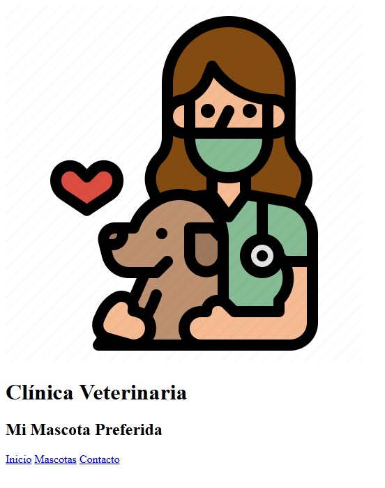

# INSTRUCCIONES

En esta guía se detallan los pasos a seguir para crear una página web para una veterinaria llamada `Mi Mascota Preferida`.

## Creación de una página web desde 0

### Código HTML

1. Cree una carpeta con su nombre y apellido `nombre-apellido` que contendrá todos los documentos necesarios para crear la página web.
2. Dentro de la carpeta que acaba de crear.

   1. Coloque la carpeta de imágenes que se le proporciono.
   2. Cree un nuevo documento HTML con el nombre `index.html` el cual contendra el codigo base.

   ```
   <!DOCTYPE html>
    <html>
    <head>
        <meta charset="UTF-8">
        <title>Clínica Veterinaria</title>
    </head>
    <body>

    </body>
    </html>
   ```

3. Crearemos primero la estructura principal de la página y luego agregaremos el estilo a la página.
4. Se le recomienda utilizar Visual Studio Code para facilitar el desarrollo.
5. Dentro de `<body>` cree las etiquetas `<header>` `<nav>` `<main>` y `<footer>` con su respectiva etiqueta de cierre. Por el momento estarán vacías.
6. Creamos un `<div>` que encierre todas las etiquetas que acabamos de agregar

```
<body>
    <div>
        <header>
        </header>
        <nav>
        </nav>
        <main>
        </main>
        <footer>
        </footer>
    <div>
  </body>
```

7. Dentro de `header` agregamos la imagen de `avatar`, un título principal (h1) `Clínica Veterinaria` y un subtíulo (h2) `Mi Mascota Preferida`. Por el momento no se preocupen si la imagen es muy grande.
   - Pista: La imagen debe contener la ubicacion de la carpeta y el nombre de la imagen con su extension en la propiedad src `src="imagenes/nombre.extension"`

<details>
<summary style="color:blue;">Resultado esperado hasta el momento</summary>


</details><br>

8. Dentro de `nav` agregamos una etiqueta `<div>`. Y dentro de esa etiqueta crearemos unos hipervínculos que harán referencia a otras páginas de nuestro sitio web.

```
<a href="index.html">Inicio</a>
<a href="mascotas.html">Mascotas</a>
<a href="contacto.html">Contacto</a>
```

<details>
<summary style="color:blue;">Resultado esperado hasta el momento</summary>



</details><br>

9. Dentro de `<main>` agregaremos la imagen gif `veterinarian`. Luego crearemos una etiqueta article y dentro agregaremos un subtítulo (h2) `Mision y Vision`y un párrafo (p) con la siguente información

```
Contamos con el mejor equipo de profesionales en la industria veterinaria, contamos con instalaciones modernas y con equipo tecnológico para poder diagnosticar, asesorar y ayudarte a cuidar a tu mascota. Contamos con mas de 15 clínicas para cubrir la Ciudad de Guatemala y estamos en proceso de crecimiento para estar cada vez más cerca de tu casa.

```

<details>
<summary style="color:blue;">Resultado esperado hasta el momento</summary>


</details><br>

1.  Dentro de `<main>` también agregaremos un hipervínculo a la página de contacto `<a href="contacto.html">Puedes contactarnos aquí</a>` y el gif `cute-dog`.

<details>
<summary style="color:blue;">Resultado esperado hasta el momento</summary>


</details><br>

11. Dentro de `<footer>` agregaremos un párrafo con el siguiente mensaje `&copy; 2025 - Sitio creado por su_nombre`

<details>
<summary style="color:blue;">Resultado esperado hasta el momento</summary>


</details><br>

12. Agregaremos un `div` despues de la etiqueta `main` simulando las redes sociales (facebook e instagram) de la empresa. Las imágenes contienen el hipervínculo que abre una nueva ventana y redirecciona a la página principal de la red social. Primero agregaremos un párrafo con el siguiente mensaje `Puedes encontrarnos en nuestras redes sociales`. Luego agregaremos la etiqueta `<a>` para agregar un nuevo hipervínculo y dentro de esta etiqueta agregaremos la imagen de la red social en específico.

Ejemplo:

```
<a href="https://www.facebook.com/" target="_blank">
    
</a>
```

<details>
<summary style="color:blue;">Resultado esperado hasta el momento</summary>


</details><br>

<details>
<summary style="color:blue;">Resultado final</summary>


</details><br>

### Agregando estilo a la página web

1. Crear un nuevo documento llamado `style.css` y guardarlo en la carpeta previamente creada.
2. En el HTML abajo de la etiqueta <title>, agregaremos la etiqueta `<link>` con la información de nuestro archivo css `<link href="style.css" rel="stylesheet" type="text/css">`.
3. En `style.css` agregaremos un color grisaseo (`#f7f7f7`) al body como color de fondo y una lista de fuentes `Arial, Helvetica, sans-serif`.

```
   body {
    background: #f7f7f7;
    font-family: Arial, Helvetica, sans-serif;
 }
```

4. En nuestro código html agregamos a nuestro div principal que engloba todas las etiquetas de body una clase llamada `container`.

<details>
<summary style="color:blue;">Resultado esperado hasta el momento</summary>


</details><br>

5. En `style.css` definiremos el estilo a la clase `container` que sera un tipo de sombra con un efecto como que sobresaliera.

```
background: white;
max-width: 960px;
margin: 60px auto;
-webkit-box-shadow: 0px 0px 30px 0px #999999;
box-shadow: 0px 0px 30px 0px #999999;

```

<details>
<summary style="color:blue;">Resultado esperado hasta el momento</summary>


</details><br>

6. En `style.css` definiremos el estilo a la etiqueta `header`. Un fondo verdoso (`#45ADA8`), una alineacion de texto centrada y un padding (espacio que se crea al rededor de los elementos, espacio arriba, espacio derecha, espacio abajo, espacio izquierda) de `70px 0px`.
<details>
<summary style="color:blue;">Resultado esperado hasta el momento</summary>


</details><br>

7. En `style.css` definiremos un tamaño a la imagen de header
```
header img {
   width: 86px; 
   height: 83px;
}
```

<details>
<summary style="color:blue;">Resultado esperado hasta el momento</summary>


</details><br>

8. En `style.css` definiremos el estilo al título de header, con un color del texto `blanco`, un tamaño de fuente de `24px`, transmorfaremos el texto a mayúsculas  `text-transform: uppercase;` y un margen de `0px`.
9. En `style.css` definiremos el estilo al subtítulo de header, con un color del texto `negro`, un tamaño de fuente de `20px`, y un margen de `10px`.
<details>
<summary style="color:blue;">Resultado esperado hasta el momento</summary>


</details><br>

10. En `style.css` definiremos el estilo de nuestro menú. Primero creando un fondo de un verde un poco mas oscuro (`#547980`) al de header.
11. En nuestro código html agregamos al div de header un atributo `class="menu"`.
12. En `style.css` definiremos el estilo de la clase `menu`. Agregando un passind de `10px` un margen izquierdo `auto`, un margen derecho `auto`, un tamaño de ancho de `50%`, y un `overflow: auto` 
```
padding: 10px;
margin-left: auto;
margin-right: auto;
width: 50%;
overflow: auto;

```
<details>
<summary style="color:blue;">Resultado esperado hasta el momento</summary>


</details><br>

13. En `style.css` definiremos el estilo de los hipervínculos de nuestro menú, dandole una posición a la izquierda (`float: left;`) un color de texto `blanco`, quitamos la decoracion de los hipervínculos, para que no se muestren como subrayados (`text-decoration: none;`) y unos márgenes de 15px y 40px (`padding: 15px 40px;`)

<details>
<summary style="color:blue;">Resultado esperado hasta el momento</summary>


</details><br>

14. En `style.css` definiremos el estilo de los hipervínculos cuando se posicionan sobre ellos dandoles un efecto de sombreado. Esto lo logramos con la pseudoclase hover (:hover). Elegiremos un color de fondo con una tonalidad café (`#594F4F`).
```
nav a:hover {
   background-color: #594F4F;
}
```
<details>
<summary style="color:blue;">Resultado esperado hasta el momento</summary>


</details><br>

15. En `style.css` definiremos el estilo del contenido principal `<main>`. Agregando un espacio de 30px alrededor de cada elemento (`padding: 30px 30px 30px 30px;`), un overflow automático, un espacio entre cada linea de 30px (`line-height: 30px;`) y una alineación del texto centrada.
<details>
<summary style="color:blue;">Resultado esperado hasta el momento</summary>


</details><br>

16. En `style.css` definiremos el estilo del subtítulo (h2) de `<main>`, agregando una lista de fuentes diferente al header `"Times New Roman", 'Times New Roman', Times, serif;`, un color de texto verde (`#547980`), transmorfaremos el texto a mayúsculas, un tamaño de fuente de `36px` y una alineación del texto centrada.
<details>
<summary style="color:blue;">Resultado esperado hasta el momento</summary>


</details><br>

17.  En `style.css` definiremos el estilo del hipervínculo `Puedes contactarnos aquí`, definiendole una clase con nombre `contact` (agregarlo la clase a la etiqueta correspondiente en el código html). El color de texto será `blanco` un padding de `10px 60px`, un color de fondo café (`#594F4F`), quitamos la decoración, un `display: block;` (esto significa que el elemento ocupará todo el ancho disponible y comenzará en una nueva línea), un ancho de `200px` un margen (`margin: 30px auto 60px auto;`) y una alineación del texto centrada. 
<details>
<summary style="color:blue;">Resultado esperado hasta el momento</summary>


</details><br>

18.  En `style.css` definiremos el estilo `hover`  con un color de fondo en tonalidad verdosa (`#547980`).
19.  En nuestro código html agregamos al div y a los hipervínculos la clase `sNetwork`
20.  En `style.css` definiremos el estilo de la clase `sNetwork`. 
```
.sNetwork {
    padding: 0px 30px 30px 30px;
    text-align: center;
 }
 
 .sNetwork a {
    text-decoration: none;
 }
```
<details>
<summary style="color:blue;">Resultado esperado hasta el momento</summary>


</details><br>

21. Por ultimo definiremos el estilo de footer
```
footer {
   background: #5e6d66;
   padding: 40 30;
   overflow: auto;
}

footer p {
   color: white;
   font-size: 14px;
   padding-left: 10px;
}
```
<details>
<summary style="color:blue;">Resultado agregando CSS</summary>


</details><br>

### Reto
Crear las páginas de mascotas.html y contacto.html utilizando el diseño existente.